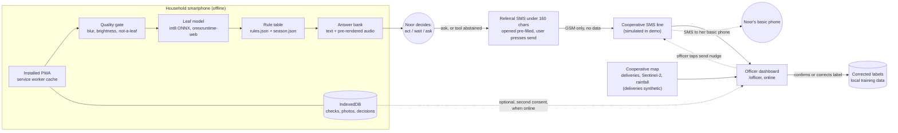

# Architecture

Status: skeleton by the docs agent, 3 Oct 2026. Source of truth for the design is `kb/MASTER_PROMPT.md` section 5. Measured values are `[PENDING: engine]` or `[PENDING: ml]`.

## 1. Diagram

Reading the diagram: solid lines work offline or on GSM only. Dotted lines need data or an officer action. The map and dashboard are on the officer side and never block the farmer app.

## 2. Components

| Component | What | Runs where | Online needed |
|---|---|---|---|
| Farmer app | React PWA, installable | Household Android phone, Chrome | First install only |
| Leaf model | MobileNetV3-Small or EfficientNet-Lite0, int8 ONNX (final choice `[PENDING: ml]`) | Browser, WASM | No |
| Quality gate | Laplacian variance, brightness, not-a-leaf score | Browser | No |
| Rule table | JSON from (incidence band, dominant class, season window) to answer ID | Browser | No |
| Answer bank | Fixed answer list with Swahili and English text; Swahili audio pre-rendered; Kikuyu audio for a subset | Bundled | No |
| Season calendar | Rain-onset and spray windows, NASA POWER 1991 to 2020 (modelled) plus Kenyan review timing (S03) | Bundled JSON | No |
| Local store | IndexedDB via `idb` | Phone | No |
| Referral | `sms:` link with a compact string. User sends. | Phone and GSM | GSM only |
| Officer dashboard | Referral queue, map, label confirm or correct | Web `/officer` (Lovable Cloud / Supabase) | Yes |
| SMS reminder line | Simulated panel, labelled simulated | Web | Yes |

## 3. Where AI is, and is not

| Step | AI? | Why |
|---|---|---|
| Reading a leaf photo | Yes, small on-device CNN | Noor cannot name the disease; this turns a photo into a symptom |
| Advice | No, rule table | An officer can audit it |
| Timing | No, calendar | Fixed windows |
| Words and audio | No at runtime; generative tools at build time only | Avoids hallucination; clips are reviewed |
| Price lookup | Out of core scope | A spreadsheet job |

## 4. Tech stack

| Layer | Choice |
|---|---|
| Frontend | Vite, React, TypeScript, Tailwind |
| Offline | `vite-plugin-pwa` (service worker), `idb` |
| Inference | `onnxruntime-web` (WASM) |
| Training | Python, PyTorch, `timm`; export ONNX; `onnxruntime.quantization` |
| Backend | Lovable Cloud / Supabase for referrals (officer side only) |
| Build-time audio | ElevenLabs (Swahili, English), Meta MMS-TTS (Kikuyu) |
| Hosting | Lovable publish; fallback Vercel or Netlify from GitHub |
| QA | `python -m qa.run` from `app/` |

## 5. Budgets

| Item | Target | Hard cap | Measured | Source of measure |
|---|---|---|---|---|
| `leaf.onnx` | 3 MB or less | 5 MB | `[PENDING: ml]` | build log |
| Offline bundle (app, model, audio) | 15 MB or less | none | `[PENDING: engine]` | build log (source: MASTER_PROMPT 5.2) |
| Audio total | 4 MB or less | none | `[PENDING: content-voice]` | file sizes |
| Inference per leaf | under 1 s | none | `[PENDING: engine]` | state device or "Chrome DevTools, 4x CPU throttle" (source: MASTER_PROMPT 5.2) |
| Download time at 1 Mbit/s | n/a | n/a | 15 MB x 8 / 1 = 120 s at the target size (our calculation, ignores overhead) | arithmetic |
| Cost of the bundle | n/a | n/a | 6.0% of Safaricom's KSh 20 / 250 MB daily bundle at the 15 MB target (our calculation; S11, price to re-check on the day) | arithmetic |
| Airplane-mode test | pass | n/a | `[PENDING: qa]` | Video 2 clip, `app/tests` |

## 6. Data flow and trust boundaries

1. Photos and results are created and stored on the phone.
2. The only default exit is the referral SMS, which the user sends.
3. Photo sync needs a second consent and a connection.
4. The officer dashboard holds referrals, not a farmer registry.
5. See `RESPONSIBLE_AI.md`, section 4, for the full table.
