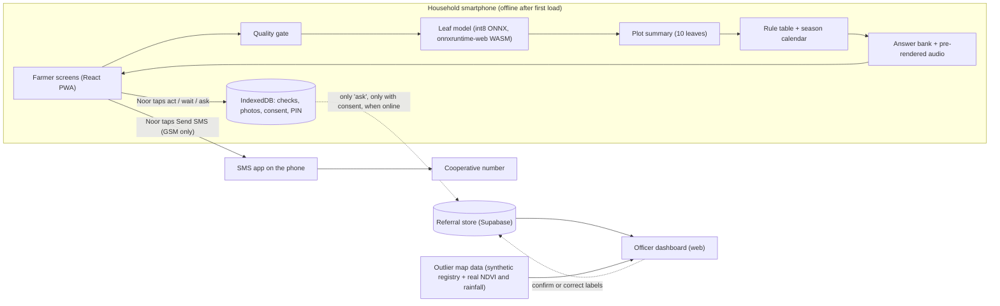

# Architecture

How the parts of Jani fit together, where each runs, and what each costs in size and time.

Status: first draft. It matches the engine on branch `cursor/engine-offline-core-d90f` ([PR #2](https://github.com/arturbarcij/mit-hackathon-7/pull/2), not merged) and the geo data on branch `cursor/geo-outlier-map-d222` ([PR #3](https://github.com/arturbarcij/mit-hackathon-7/pull/3), not merged). The farmer screens, the officer dashboard and the real leaf model are not built yet. File paths below are relative to `app/`.

## Diagram

Solid lines work offline, except the SMS, which needs a GSM signal but no data bundle. Dotted lines need a data connection and the farmer's consent.

## Components

| Component | What | Where it runs | Online needed? | Files (engine branch unless noted) | State |
|---|---|---|---|---|---|
| Farmer app | React PWA, installable, service-worker cached | Household Android smartphone, Chrome | First install only | `vite.config.ts` (vite-plugin-pwa, precaches `js, mjs, css, html, svg, png, json, onnx, wasm, gz, mp3`), `src/hooks/useEngine.ts`, `public/pwa-*.png` | Engine and hooks built. Screens not built yet (ui) |
| Leaf model | Small CNN, fine-tuned, int8 ONNX | In the browser via onnxruntime-web 1.22.0 (WASM, 1 thread) | No | `src/engine/model.ts`, `preprocess.ts`, `scoring.ts`, `model.mock.ts`, `public/ort/ort-wasm-simd-threaded.{mjs,wasm.gz}` | Runner built and tested on a fixture model. Real model not delivered yet (ml). Falls back to a labelled mock |
| Quality gate | Brightness, sharpness (Laplacian variance over brightness squared), minimum size | In the browser | No | `src/engine/quality.ts`, `canvas.ts`, `source.ts` | Built. Thresholds tuned on synthetic images only |
| "Not a coffee leaf" check | A `not_leaf` class in the model, plus the abstention threshold | In the browser | No | `src/engine/scoring.ts`, `plot.ts` | Built in the engine. A separate out-of-distribution score is not built |
| Plot summary | Counts per class over the sampled leaves; unsure leaves counted apart | In the browser | No | `src/engine/plot.ts` | Built |
| Rule table | JSON: plot summary and season window to answer ID; first match wins; last rule "ask the officer" | In the browser | No | `src/engine/decide.ts`, `content.ts`, `src/content/rules.json` (placeholder in `src/engine/placeholders/`) | Engine built. Final rules not delivered yet (content-voice) |
| Answer bank | Fixed answer IDs with Swahili, Kikuyu and English text, and audio per language | Bundled | No | `src/engine/decide.ts`, `audio.ts`, `src/content/answers.json`, `public/audio/<lang>/<id>.mp3` | Engine built with a placeholder bank. Final text and audio not delivered yet |
| Season calendar | Five named windows for Mathira West, Nyeri, from NASA POWER 1991 to 2020 | Bundled JSON | No | `src/engine/season.ts`, `src/content/season.json` | Built. Research calendar copied in |
| Local store | IndexedDB: checks, photos (at most 800 px), consent, optional PIN, outbox | Phone | No | `src/engine/storage.ts` | Built |
| Referral | `JANI1` SMS string, at most 130 characters by design (limit 160), opened via an `sms:` link; Noor sends | Phone and GSM | GSM only | `src/engine/referral.ts` | Built |
| Sync | Store and forward of "ask" referrals with consent | Phone, when online | Yes | `src/engine/sync.ts` | Built. Backend table and photo upload not built yet (ui) |
| Officer dashboard | Referral queue, map, confirm or correct labels, export | Web, `/officer` route | Yes | Not built yet (ui) | Not built yet |
| Outlier map data | Plots that fell or rose far more than neighbours; abstains where data is thin | Static files read by the dashboard | Yes | `geo/`, `public/geo/{plots.geojson,outliers.json,ndvi_change.png}` (geo branch) | Data built. Registry is synthetic. Map UI not built yet |
| SMS reminder line | Simulated panel, labelled "simulated" | Web | Yes | Not built yet | Not built yet |

The outlier map is not in the master prompt's component list (Section 5.1). It was added by the geo agent and feeds only the officer side.

## Tech stack

- Frontend: Vite 8, React 19, TypeScript 6, vite-plugin-pwa 2, `idb` 8, onnxruntime-web 1.22.0 (versions from `package.json` on the engine branch).
- UI: built in Lovable (not built yet).
- Training: Python, PyTorch and `timm`, export to ONNX, int8 quantisation with `onnxruntime.quantization` (ml agent, in progress).
- Referral store: Lovable Cloud or Supabase, publishable key only in the client (not built yet).
- Geo: Python, Sentinel-2 L2A via Earth Search STAC, NASA POWER (geo branch).
- Tests: Vitest (107 tests) and Playwright (7 tests) on the engine branch, run by the GitHub Actions workflow `engine.yml`.
- Hosting: Lovable publish, fallback Vercel or Netlify. No live URL yet.

## Budgets

Targets are from the master prompt. Measured values are from `kb/STATUS.md` on the engine branch, measured on Sat 3 Oct 2026.

| Item | Target | Measured | Measured with |
|---|---|---|---|
| `leaf.onnx` | at most 3 MB, hard cap 5 MB | not delivered yet | |
| Offline precache | at most 15 MB | 3.1 MiB | App shell, engine, gzipped ORT runtime (2.8 MiB, from 11.2 MB raw), **fixture model (303 bytes, not coffee)**, icons. No real model, no audio |
| Audio total | at most 4 MB | not rendered yet | |
| Model load | not set | 0.55 s | Chrome 148, 4x CPU throttle, fixture model |
| Inference per leaf | under 1 s | 0.10 to 0.15 s from a 3000 x 2250 photo to a result | Chrome 148, 4x CPU throttle, **fixture model only**. Must be re-measured with `leaf.onnx` |
| Airplane mode | full check works after first load | Full ten-leaf check passes in Playwright with the service worker and the network off | Chromium, production build, fixture model. Not yet on a real Android phone |

Download time and cost, derived from the measured 3.1 MiB precache (about 3.25 MB). These will rise once the model and audio land:
- At 1 Mbit/s: 3.25 MB x 8 = 26 Mbit, so about 26 seconds (derived).
- Cost: fits inside Safaricom's KES 5 daily bundle of 7 MB [safaricom-data-faq]. At the out-of-bundle rate of KES 4.57 per MB [safaricom-data-terms], 3.25 x 4.57 is about KES 15 (derived). Prices checked 3 Oct 2026; they vary by plan.
- Engine estimate for the full bundle at worst: 3.1 + model (at most 5) + audio (at most 4) = about 12 MiB. This is an estimate, not a measurement.

## Data flow and privacy, in one place

- Photos and results stay on the phone by default.
- `choose()` saves the decision locally and sends nothing.
- The SMS is built on the phone; Noor presses send.
- Sync sends only checks where Noor chose "ask" and gave main consent. Photos go only with the second consent.
- Details in `RESPONSIBLE_AI.md`.
