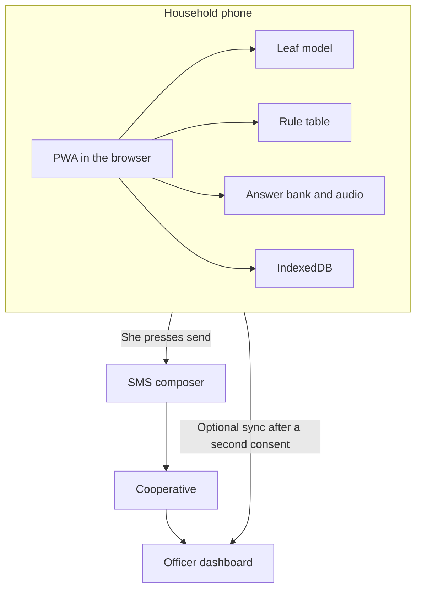

# Architecture

The farmer's check runs on the household smartphone with no data connection after install. SMS uses the mobile network only when she presses send. The officer dashboard is optional and online.

The leaf model is not trained in this checkout. `public/model/leaf.onnx` is not in this tree.

## Diagram

The phone holds the PWA, the model, the rules, the answers, the audio and IndexedDB. The SMS leaves only when she presses send. Photo sync to the dashboard waits for the second consent. The weekday reminder line, if shown, is a simulation and is tagged synthetic.

## Components

| Component | Role | Where it runs | Network |
|---|---|---|---|
| Farmer app | Installable PWA | Household Android phone, Chrome | First install only |
| Leaf model | Small convolutional network, int8 ONNX, `onnxruntime-web` | Browser | No |
| Quality gate | Blur, brightness, and a not-a-leaf check | Browser | No |
| Rule table | Incidence band, dominant class and season window to an answer id | Browser, JSON | No |
| Answer bank | Fixed ids, text and pre-rendered audio | Bundled | No |
| Season file | Rain windows cached at install. NASA POWER is the modelled source (S33) | Bundled JSON | No |
| Local store | Checks, photos, decisions, both consents | IndexedDB | No |
| Referral | One SMS, member number, no name. She presses send | Phone, GSM | GSM only |
| Officer dashboard | Queue, confirm or correct, export of corrected labels | Web | Yes |
| SMS reminder | Simulated panel | Web | Yes, and labelled synthetic |

## Tech stack

In this checkout, `package.json` has Vite, React, TypeScript, React Router, `onnxruntime-web`, `idb` and `vite-plugin-pwa`. `vite.config.ts` registers the React plugin.

Planned and not claimed as wired up here: a service worker that caches the app, the model and the audio; an officer route; referral storage for the dashboard. The training path, when it runs, is Python, PyTorch and ONNX, outside the phone.

No runtime language model in the client. ElevenLabs, MMS-TTS and NLLB are build-time only. See [LANGUAGES.md](LANGUAGES.md).

## Budgets

Targets are design limits from the project brief. The measured column is empty on purpose.

| Item | Target | Measured |
|---|---|---|
| Model file | 3 MB or less. Hard cap 5 MB | [PENDING: ml] |
| Offline bundle: app, model and audio | 15 MB or less | [PENDING: engine] |
| Download of a 15 MB bundle at 1 Mbit/s | 120 seconds. My calculation on the target (research note E8). Ignores protocol overhead | [PENDING: engine] |
| Download of a 5 MB model at 1 Mbit/s | 40 seconds. Same calculation, on the cap | [PENDING: ml] |
| Cost context | Safaricom daily 250 MB is KSh 20 for 24 hours (S11, accessed 3 Oct 2026). A 15 MB target is 6.0% of 250 MB (my calculation, E8). Daily 1.5 GB is KSh 99 (S11). Prices change | [PENDING: engine] |
| Inference | Under 1 second per leaf on a low-end Android, or Chrome DevTools at 4x CPU throttling if no handset is available. State which | [PENDING: ml] |
| Offline | Airplane mode after the first load, full leaf check | [PENDING: engine] |

MMS-TTS and NLLB weights are build machines, not this bundle. Their sizes are in [DATA_CARD.md](DATA_CARD.md). They are far larger than the 15 MB target and must not be shipped to the phone.

## Non-goals

- No chatbot and no generated advice on the phone.
- No berry, root or nutrient diagnosis.
- No product name and no dose.
- No farmer account.
- No automatic send.
